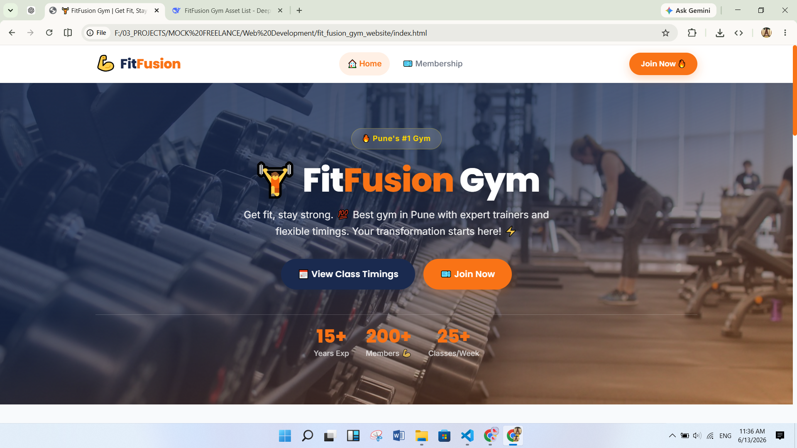
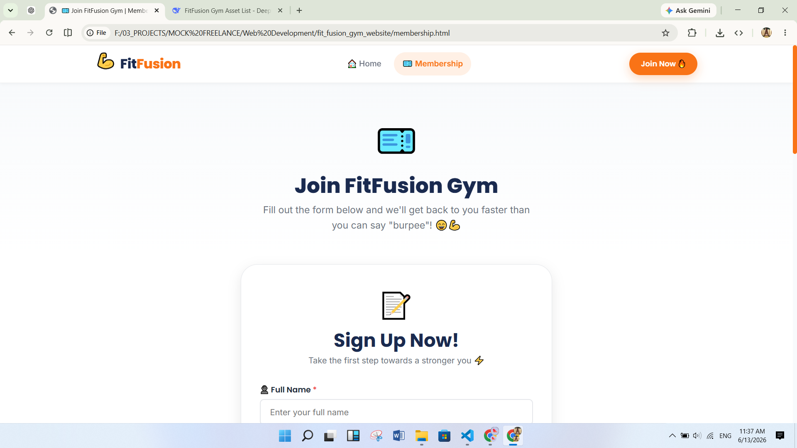
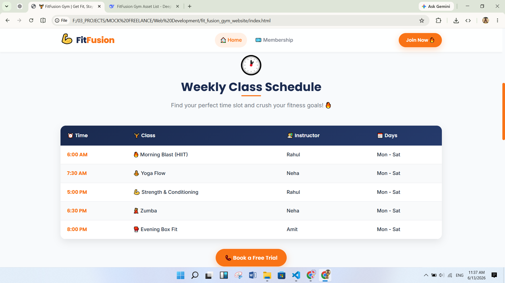
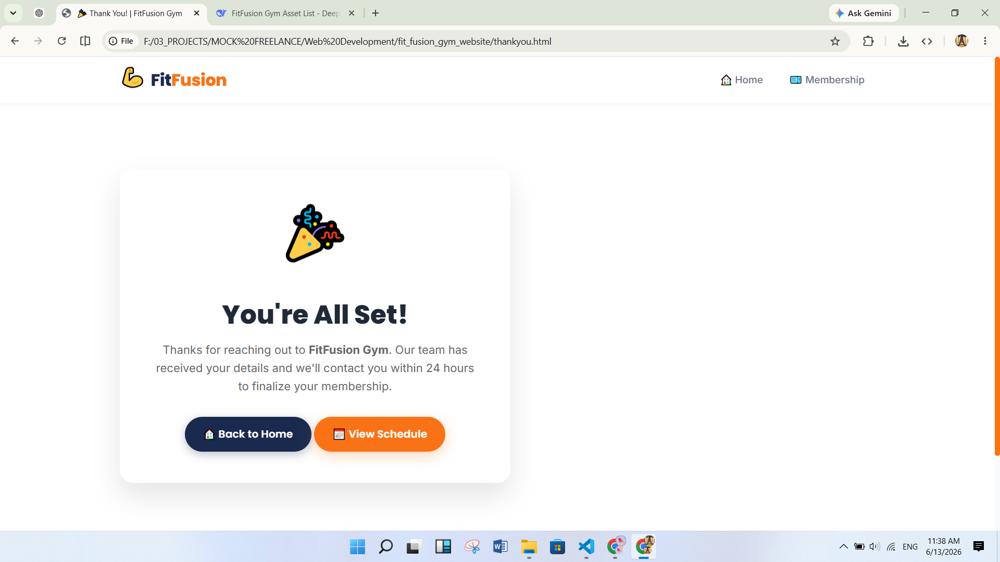
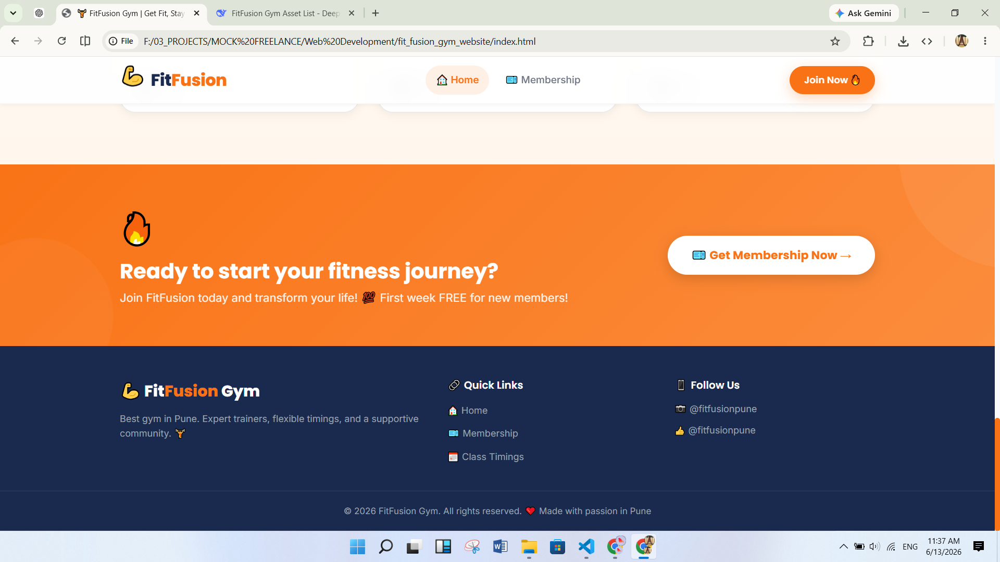

# 💪 FitFusion Gym – Modern Fitness Website

[](https://developer.mozilla.org/en-US/docs/Web/HTML)
[](https://developer.mozilla.org/en-US/docs/Web/CSS)
[](https://developer.mozilla.org/en-US/docs/Web/JavaScript)
[](https://developer.mozilla.org/en-US/docs/Learn/CSS/CSS_layout/Responsive_Design)
[](https://formspree.io/)
[](https://fonts.google.com/)

> **FitFusion Gym** – A vibrant, modern, and fully responsive website for a gym in Pune.  
> It showcases class schedules, trainer profiles, a membership lead form, and a thank‑you page with confetti animation.

🔗 **Live Demo** – *Not hosted yet, but ready to deploy!*

---

## 📸 Screenshots

| Home Page | Membership Form | Class Schedule | Thank You Page |
|-----------|----------------|----------------|----------------|
|  |  |  |  |
| *Hero + stats + CTA* | *Lead capture form* | *Weekly class table* | *Confetti + success message* |

*Footer preview:*  


---

## ✨ Features

- 🏠 **Hero Section** – Eye‑catching background, animated numbers (15+ years, 200+ members), and call‑to‑action buttons.
- 📅 **Weekly Class Schedule** – Responsive table that transforms into stacked cards on mobile.
- 👨‍🏫 **Trainer Profiles** – Three trainers with hover effects, social links, and placeholder images.
- 🎫 **Membership Lead Form** – Client‑side validation (name, phone, email, interest) and Formspree AJAX submission.
- 🎉 **Thank You Page** – Celebration confetti animation and friendly messaging.
- 📱 **Fully Responsive** – Works on desktops, tablets, and phones (mobile‑first CSS with breakpoints at 1024px, 768px, 480px).
- 🍔 **Mobile Navigation** – Hamburger menu with smooth open/close, accessible ARIA attributes.
- 🧭 **Active Link Highlighting** – Automatic navigation highlighting based on current page.
- 🖱️ **Smooth Scrolling** – Internal anchor links (`#class-timings`) scroll smoothly.
- 💬 **Formspree Ready** – Just replace the mock endpoint with your real Formspree ID and it works.

---

## 🛠️ Built With

- **HTML5** – Semantic markup, accessibility (aria‑labels).
- **CSS3** – Custom properties (variables), Flexbox, Grid, gradients, keyframe animations, backdrop‑filter.
- **JavaScript (Vanilla)** – Mobile menu, form validation, number animation, Formspree fetch, active nav, dynamic copyright year.
- **External Libraries** – Canvas Confetti (thank you page).
- **Fonts** – Google Fonts: Inter (body) + Poppins (headings).
- **Images** – Unsplash (hero background), Random User API (trainer placeholders).

---

## 📁 Folder Structure
```text
fit_fusion_gym_website/
│
├── index.html           # Home page
├── membership.html      # Membership lead form page
├── thankyou.html        # Confirmation page with confetti
│
├── css/
│   ├── style.css        # Main styles (variables, components, animations)
│   └── responsive.css   # Media queries (mobile/tablet)
│
├── js/
│   ├── main.js          # Mobile menu, form validation, Formspree AJAX, active nav
│   └── number_run.js    # Number counter animation (hero stats)
│
├── screenshots/         # All screenshots used in this README
│   ├── home_page.PNG
│   ├── membership.PNG
│   ├── routine.PNG
│   ├── thank_you_page.PNG
│   └── footer.PNG
│
└── README.md            # You are here!
```

---

## 🚀 Getting Started

1. **Clone the repository**  
   ```bash
   git clone https://github.com/affan675/fitfusion-gym.git
   ```
2. **Open the project** – Simply open `index.html` in your browser. No build step required.
3. **Make the form work** – 
   - Create a free account at Formspree.
   - Create a new project and get your form endpoint (e.g., `https://formspree.io/f/xyz...`).
   - In `js/main.js`, replace the `formspreeEndpoint` URL inside `submitFormViaFetch()` with your real endpoint.
4. **Customize content** – Edit the HTML to change trainer names, class timings, contact details, etc.

---

## 🎯 Special Enhancements (Suggested for Contributors)
These are features that I, as the project creator, would love to see added. Feel free to contribute!

- 🌐 **Backend Integration** – Replace Formspree with a proper Node.js/PHP backend that stores leads in a database and sends automated emails.
- 🔐 **reCAPTCHA** – Add Google reCAPTCHA v3 to the membership form to prevent spam.
- 📊 **Admin Dashboard** – A simple password‑protected dashboard to view all form submissions.
- 🗺️ **Google Maps Integration** – Show the gym’s actual location on the contact section.
- 📱 **PWA Support** – Make the website installable as a Progressive Web App with a service worker.
- 🏋️ **Live Class Booking** – Let members reserve spots for specific time slots (requires backend + database).
- 💬 **Chat Widget** – Integrate a simple chat (like Tawk.to) for instant visitor support.
- 🎨 **Dark Mode** – Add a theme switcher (light/dark) using CSS custom properties.
- 📈 **Analytics** – Add Google Analytics or a privacy‑friendly alternative (Plausible, Umami).

---

## 🤝 Contributing
Contributions, issues, and feature requests are welcome!  
Feel free to check the issues page if you want to report a bug or propose an idea.

1. Fork the project
2. Create your feature branch (`git checkout -b feature/amazing-feature`)
3. Commit your changes (`git commit -m 'Add some amazing feature'`)
4. Push to the branch (`git push origin feature/amazing-feature`)
5. Open a Pull Request

Please make sure to follow the existing code style (semantic HTML, modular CSS, clean JS).

---

## 📬 Contact
**Author – Affan Adil**
- 🧑‍💻 GitHub: @affan675
- 📧 Email: affanadil119@gmail.com
- Project Link: https://github.com/affan675/fitfusion-gym

---

## 📄 License
This project is open source and available under the **MIT License**.  
See the LICENSE file for more info.

---

**Made with ❤️ and 💪 in Pune.**